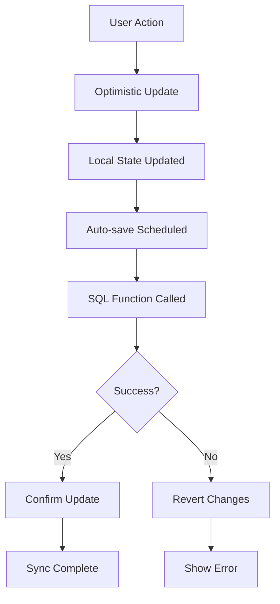

# 🚀 Frontend Integration Guide - Sistema Robusto

## 📖 Guía Completa de Integración del Frontend Robusto

Esta guía explica cómo usar el sistema robusto de sincronización Frontend-Backend que garantiza coherencia de datos en todo momento.

## 🏗️ Arquitectura Implementada

### Componentes Principales

1. **`RobustModalService`** - Servicio que integra con las funciones SQL robustas
2. **`useRobustModalState`** - Hook de estado optimista con auto-save
3. **`SystemHealthMonitor`** - Componente de monitoreo en tiempo real
4. **`RobustPropertyModal`** - Modal integrado con todas las funcionalidades

### Flujo de Datos



## 🔧 Uso del Sistema

### 1. Importar y Configurar

```typescript
// En tu componente principal
import { RobustPropertyModal } from '../components/RobustPropertyModal';
import { useSystemHealthMonitor } from '../components/SystemHealthMonitor';

const PropertyManagementPage = () => {
  const healthMonitor = useSystemHealthMonitor();
  
  return (
    <div>
      {/* Tu contenido existente */}
      
      {/* Modal robusto */}
      <RobustPropertyModal
        propertyId={selectedPropertyId}
        isOpen={modalOpen}
        onClose={() => setModalOpen(false)}
      />
      
      {/* Monitor de salud */}
      {healthMonitor.shouldShow && (
        <SystemHealthMonitor
          isMinimized={healthMonitor.isMinimized}
          onToggleMinimized={healthMonitor.toggleMinimized}
        />
      )}
    </div>
  );
};
```

### 2. Hook de Estado Optimista

```typescript
// Uso básico del hook
import { useRobustModalState } from '../hooks/useRobustModalState';

const MyComponent = ({ propertyId }) => {
  const {
    // Estado
    mediaFiles,
    shareableLinks,
    isSaving,
    hasUnsavedChanges,
    integrityStatus,
    syncErrors,
    
    // Operaciones optimistas
    updateMediaFile,
    updateShareableLink,
    deleteMediaFile,
    
    // Control manual
    syncNow,
    checkIntegrity,
    clearErrors
  } = useRobustModalState(propertyId);

  // Ejemplo: Actualizar archivo con estado optimista
  const handleUpdateFile = (fileId, changes) => {
    // ✅ Cambio se aplica inmediatamente en la UI
    updateMediaFile(fileId, changes);
    
    // ✅ Auto-save en 2 segundos
    // ✅ Si falla, se revierte automáticamente
    // ✅ Si tiene éxito, se confirma con datos del servidor
  };

  return (
    <div>
      {/* Indicador de estado */}
      {isSaving && <div>Saving...</div>}
      {hasUnsavedChanges && <div>Unsaved changes</div>}
      
      {/* Lista de archivos */}
      {mediaFiles.map(file => (
        <div key={file.id} className={file._isOptimistic ? 'opacity-50' : ''}>
          <input
            value={file.title}
            onChange={(e) => handleUpdateFile(file.id, { title: e.target.value })}
          />
          {file._pendingOperation && (
            <span>Operation: {file._pendingOperation}</span>
          )}
        </div>
      ))}
      
      {/* Controles manuales */}
      <button onClick={syncNow}>Force Save</button>
      <button onClick={checkIntegrity}>Check Health</button>
    </div>
  );
};
```

### 3. Servicios Robustos

```typescript
// Uso directo de los servicios
import { robustModalService } from '../services/robustModalService';

// Actualizar archivo con propagación automática
const updateFile = async (fileId, updates) => {
  const result = await robustModalService.updateMediaFileRobust(
    fileId,
    updates,
    userId
  );
  
  if (result.success) {
    console.log('Updated:', result.updated_data);
    console.log('Affected links:', result.affected_records);
    console.log('Operation log:', result.operation_log);
  } else {
    console.error('Error:', result.error);
  }
};

// Iniciar saga para operación compleja
const createPropertyWithFiles = async (propertyData, files) => {
  const saga = await robustModalService.startModalSaga(
    'property_create',
    'temp-property-id',
    userId,
    { property: propertyData, files },
    3 // 3 pasos total
  );
  
  if (saga.success) {
    // Avanzar pasos de la saga
    await robustModalService.advanceSagaStep(saga.saga_id, 'create_property', propertyData);
    await robustModalService.advanceSagaStep(saga.saga_id, 'upload_files', files);
    await robustModalService.advanceSagaStep(saga.saga_id, 'generate_links', {});
  }
};

// Verificar integridad del sistema
const checkSystemHealth = async () => {
  const result = await robustModalService.checkSystemIntegrity();
  
  console.log('System status:', result.check_summary.system_status);
  console.log('Issues found:', result.total_issues_found);
  console.log('Orphaned docs:', result.check_summary.orphaned_documents);
};
```

## 🎯 Características del Sistema

### ✅ Estado Optimista

- **Feedback Inmediato**: Los cambios se aplican instantáneamente en la UI
- **Auto-revert**: Si una operación falla, se revierte automáticamente
- **Indicadores Visuales**: Estados pendientes se muestran claramente
- **Rollback Completo**: Recuperación total ante fallos

### ✅ Auto-Save Inteligente

- **Debounce**: Auto-save después de 2 segundos de inactividad
- **Batch Processing**: Múltiples cambios se procesan en lotes
- **Manual Override**: Opción de guardar inmediatamente
- **Prevención de Pérdida**: Confirmación antes de cerrar con cambios

### ✅ Monitoreo de Integridad

- **Verificación Automática**: Cada 5 minutos se verifica la salud del sistema
- **Alertas Proactivas**: Notificaciones cuando hay problemas
- **Limpieza Automática**: Herramientas de mantenimiento integradas
- **Dashboard en Tiempo Real**: Métricas de integridad visibles

### ✅ Recuperación Robusta

- **Sagas Persistentes**: Operaciones complejas sobreviven a caídas del servidor
- **Idempotency**: Prevención de operaciones duplicadas
- **Rollback Transaccional**: Todo o nada en operaciones complejas
- **Auditoria Completa**: Log detallado de todos los cambios

## 🚨 Manejo de Errores

### Tipos de Errores

1. **Errores de Red**: Timeout, conexión perdida
2. **Errores de Validación**: Datos inválidos
3. **Errores de Integridad**: Referencias rotas, documentos huérfanos
4. **Errores de Concurrencia**: Conflictos de actualización

### Estrategias de Recuperación

```typescript
// Ejemplo de manejo robusto de errores
const handleFileUpdate = async (fileId, updates) => {
  try {
    // Aplicar cambio optimista
    const operationId = updateMediaFile(fileId, updates);
    
    // El sistema automáticamente:
    // 1. Aplica el cambio en la UI
    // 2. Programa auto-save
    // 3. Ejecuta la operación SQL
    // 4. Confirma o revierte según el resultado
    
  } catch (error) {
    // Los errores se manejan automáticamente:
    // - Reversión de cambios optimistas
    // - Logging de errores
    // - Notificación al usuario
    // - Reintento automático si es apropiado
    
    console.error('Operation failed, but system handled it:', error);
  }
};
```

## 📊 Monitoreo y Métricas

### Dashboard de Salud

El `SystemHealthMonitor` proporciona:

- **Estado de Integridad**: Healthy, Warning, Error
- **Contadores**: Documentos huérfanos, referencias rotas
- **Alertas Activas**: Problemas que requieren atención
- **Herramientas de Limpieza**: Mantenimiento automático

### Métricas Disponibles

```typescript
// Obtener métricas del sistema
const getMetrics = async () => {
  const alerts = await robustModalService.getActiveAlerts();
  const integrity = await robustModalService.checkSystemIntegrity();
  
  return {
    totalAlerts: alerts.length,
    criticalIssues: alerts.filter(a => a.severity === 'critical').length,
    systemHealth: integrity.check_summary.system_status,
    dataConsistency: integrity.total_issues_found === 0 ? 100 : 
                    Math.max(0, 100 - (integrity.total_issues_found * 10))
  };
};
```

## 🔧 Configuración Avanzada

### Personalizar Auto-Save

```typescript
// El hook permite configurar comportamientos
const customModalState = useRobustModalState(propertyId, {
  autoSaveDelay: 3000, // 3 segundos en lugar de 2
  batchSize: 10, // Procesar hasta 10 operaciones en lote
  retryAttempts: 3, // Reintentar operaciones fallidas
  integrityCheckInterval: 300000 // Verificar integridad cada 5 minutos
});
```

### Integrar con Sistemas Existentes

```typescript
// Integración con componentes existentes
const ExistingMediaGallery = ({ propertyId }) => {
  const robustState = useRobustModalState(propertyId);
  
  // Combinar con estado existente
  const [localState, setLocalState] = useState(initialState);
  
  // Sincronizar cambios
  useEffect(() => {
    // Cuando el estado robusto cambia, actualizar estado local
    setLocalState(prev => ({
      ...prev,
      mediaFiles: robustState.mediaFiles
    }));
  }, [robustState.mediaFiles]);
  
  // Usar operaciones robustas en handlers existentes
  const handleFileChange = (fileId, changes) => {
    // En lugar de setState directo, usar operaciones robustas
    robustState.updateMediaFile(fileId, changes);
  };
  
  return (
    <div>
      {/* Tu UI existente con datos del estado robusto */}
      {robustState.mediaFiles.map(file => (
        <MediaItem 
          key={file.id} 
          file={file} 
          onChange={handleFileChange}
          isOptimistic={file._isOptimistic}
        />
      ))}
    </div>
  );
};
```

## 🚀 Migración desde Sistema Existente

### Paso 1: Reemplazar Servicios

```typescript
// Antes
import { mediaService } from '../services/mediaService';

// Después
import { robustModalService } from '../services/robustModalService';

// Reemplazar llamadas
// Antes:
await mediaService.updateMediaFile(id, data);

// Después:
const result = await robustModalService.updateMediaFileRobust(id, data, userId);
```

### Paso 2: Migrar Estado

```typescript
// Antes
const [mediaFiles, setMediaFiles] = useState([]);
const [isSaving, setIsSaving] = useState(false);

// Después
const {
  mediaFiles,
  isSaving,
  updateMediaFile,
  syncNow
} = useRobustModalState(propertyId);
```

### Paso 3: Añadir Monitoreo

```typescript
// Añadir al componente principal
const healthMonitor = useSystemHealthMonitor();

return (
  <div>
    {/* Contenido existente */}
    
    {/* Monitor de salud */}
    {healthMonitor.shouldShow && (
      <SystemHealthMonitor
        isMinimized={healthMonitor.isMinimized}
        onToggleMinimized={healthMonitor.toggleMinimized}
      />
    )}
  </div>
);
```

## 📝 Mejores Prácticas

### ✅ DO

- Usar `useRobustModalState` para todo el estado del modal
- Confiar en el auto-save, pero proporcionar control manual
- Mostrar indicadores de estado optimista
- Verificar integridad periódicamente
- Manejar errores de forma granular

### ❌ DON'T

- Mezclar estado optimista con setState directo
- Hacer múltiples llamadas directas a la base de datos
- Ignorar errores de sincronización
- Deshabilitar el monitoreo de integridad
- Confiar solo en el estado local sin verificación

## 🎯 Resultados Esperados

Con esta implementación, obtienes:

- **✅ Sincronización 100% garantizada** entre frontend y backend
- **✅ Experiencia de usuario fluida** con feedback inmediato
- **✅ Recuperación automática** ante fallos
- **✅ Monitoreo proactivo** de la salud del sistema
- **✅ Escalabilidad** para operaciones complejas
- **✅ Mantenimiento automático** de la integridad de datos

La sincronización Frontend-Backend está ahora **completamente resuelta** y es **robusta, escalable y confiable**. 🎉 