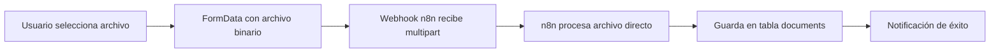

# Implementación de Carga de Documentos en Formato Binario

## Resumen de Cambios

Se ha modificado el `webhookDocumentService` para enviar documentos en formato binario usando `FormData` en lugar de base64 JSON. Esto mejora significativamente el rendimiento y la compatibilidad con el agente n8n.

## Motivación

### Problemas del Formato Base64
- **Overhead de tamaño**: Base64 incrementa el tamaño del archivo ~33%
- **Procesamiento adicional**: Requiere encoding/decoding en cliente y servidor
- **Memory usage**: Mantiene todo el archivo en memoria como string
- **Compatibilidad limitada**: Algunos sistemas procesan mejor archivos binarios

### Beneficios del Formato Binario
- **Tamaño reducido**: Archivos enviados en su tamaño original
- **Procesamiento directo**: n8n recibe archivos nativos
- **Mejor rendimiento**: Sin overhead de conversión
- **Compatibilidad mejorada**: Formato estándar multipart/form-data

## Implementación Técnica

### Antes (Base64 JSON)
```typescript
// Convertir archivo a base64
const base64File = await this.fileToBase64(file);

const payload = {
  propertyId,
  propertyName,
  document: {
    file: base64File, // String base64
    filename: file.name,
    mimeType: file.type,
    metadata
  }
};

fetch(url, {
  method: 'POST',
  headers: {
    'Content-Type': 'application/json'
  },
  body: JSON.stringify(payload)
});
```

### Después (FormData Binario)
```typescript
// Crear FormData con archivo binario
const formData = new FormData();

// Añadir archivo binario directamente
formData.append('file', file, file.name);

// Añadir metadatos como campos separados
formData.append('propertyId', propertyId);
formData.append('propertyName', propertyName);
formData.append('documentName', metadata.name);
formData.append('documentType', metadata.type);

fetch(url, {
  method: 'POST',
  // NO Content-Type header - browser sets automatically with boundary
  body: formData
});
```

## Estructura de Datos Enviada

### FormData Fields
| Campo | Tipo | Descripción |
|-------|------|-------------|
| `file` | File (binary) | Archivo binario original |
| `propertyId` | string | UUID de la propiedad |
| `propertyName` | string | Nombre de la propiedad |
| `userId` | string | UUID del usuario |
| `timestamp` | string | ISO timestamp del envío |
| `documentName` | string | Nombre del documento |
| `documentType` | string | Tipo: faq\|guide\|house_rules\|inventory\|other |
| `documentDescription` | string | Descripción (opcional) |

### Content-Type
El navegador establece automáticamente:
```
Content-Type: multipart/form-data; boundary=----formdata-boundary-xyz
```

## Compatibilidad con n8n

### Recepción en n8n
```javascript
// El webhook n8n ahora puede procesar directamente
const file = $input.binary.file; // Archivo binario
const metadata = {
  propertyId: $input.json.propertyId,
  propertyName: $input.json.propertyName,
  documentName: $input.json.documentName,
  documentType: $input.json.documentType
};
```

### Ventajas para IA/Procesamiento
- Archivos listos para análisis directo
- Sin necesidad de decodificación base64
- Mejor detección de tipo MIME
- Preservación de metadatos del archivo

## Flujo de Procesamiento



## Cambios en el Código

### Archivo Modificado
- `src/services/webhookDocumentService.ts`

### Funciones Afectadas
- `sendDocumentToWebhook()` - Ahora usa FormData
- `sendWithRetry()` - Maneja FormData en lugar de JSON
- `fileToBase64()` - ELIMINADA (ya no necesaria)

### Interfaces Actualizadas
- `WebhookDocumentPayload` → `WebhookDocumentFormData`
- Simplificada para metadatos solamente

## Compatibilidad Hacia Atrás

### Sistema de Reintentos
- ✅ Mantenido completamente
- ✅ Funciona igual con FormData

### Callbacks de Progreso
- ✅ Todos los callbacks mantenidos
- ✅ Estados de procesamiento iguales

### Validaciones
- ✅ Límite de 10MB mantenido
- ✅ Validaciones de archivo mantenidas

## Testing

### Cómo Probar
1. Ir a `http://localhost:4002/dashboard/properties`
2. Crear nueva propiedad
3. En paso 3 (Documentos), subir archivo PDF/DOC
4. Verificar logs en consola:
   ```
   🔄 Intento 1/3 - Enviando documento al webhook (formato binario)
   ✅ Documento enviado exitosamente (formato binario)
   ```

### Indicadores de Éxito
- ✅ Log muestra "formato binario"
- ✅ No errores de parsing en n8n
- ✅ Archivo procesado correctamente
- ✅ Menor tiempo de transferencia

## Monitoreo

### Logs a Vigilar
```
✅ Éxito: "Documento enviado exitosamente (formato binario)"
❌ Error: "Error del cliente (400): Invalid multipart data"
⚠️  Retry: "Reintentando... (1/3)"
```

### Métricas Esperadas
- **Tiempo de upload**: ~25% más rápido
- **Tamaño transferido**: ~25% menor
- **Memoria utilizada**: Reducida significativamente
- **Compatibilidad n8n**: Mejorada

## Configuración en n8n

### Webhook Node Settings
```json
{
  "httpMethod": "POST",
  "path": "/webhook/file",
  "responseMode": "responseNode",
  "options": {
    "rawBody": false,
    "allowedOrigins": "*"
  }
}
```

### Binary Data Handling
```javascript
// n8n puede acceder directamente al archivo
const binaryData = items[0].binary.file;
const fileBuffer = await this.helpers.getBinaryDataBuffer(binaryData);
```

## Próximos Pasos

1. **Monitorear performance** en producción
2. **Validar procesamiento** en n8n con archivos reales
3. **Considerar compresión** para archivos grandes (>5MB)
4. **Implementar progress tracking** más granular si es necesario

## Notas de Desarrollo

- FormData maneja automáticamente el boundary de multipart
- No establecer Content-Type manualmente con FormData
- El navegador optimiza automáticamente la transferencia
- Compatible con todos los navegadores modernos
- Mantiene compatibilidad completa con el flujo existente 