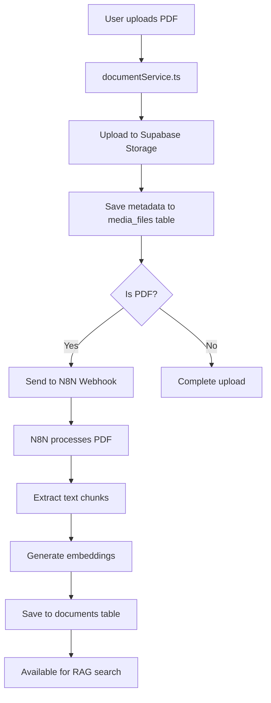

# Document Vectorization Guide

## Overview

This guide explains how documents are uploaded, processed, and vectorized in the HostHelper AI system for RAG (Retrieval-Augmented Generation) functionality.

## Updated Data Flow (Corrected Structure)

### Current Implementation



### Key Components

1. **Frontend Upload**: User uploads documents through the PropertyDocumentsForm
2. **Storage**: Files stored in Supabase Storage bucket
3. **Metadata**: Document metadata saved to `media_files` table (NOT `property_documents`)
4. **Webhook**: PDF documents sent to N8N for vectorization
5. **Processing**: N8N extracts text, chunks it, and generates embeddings
6. **Storage**: Vectorized content stored in `documents` table

## Database Tables

### media_files (File Storage)
```sql
-- All files (images and documents) are stored here
CREATE TABLE media_files (
  id uuid PRIMARY KEY,
  property_id uuid REFERENCES properties(id),
  file_type media_file_type, -- 'image' or 'document'
  category media_category_type, -- 'document_general', 'document_manual', etc.
  subcategory text, -- 'faq', 'guide', 'house_rules', etc.
  title text NOT NULL,
  description text,
  file_url text NOT NULL,
  public_url text,
  file_size integer,
  mime_type text,
  n8n_execution_id text, -- Set when sent for vectorization
  n8n_metadata jsonb,
  created_at timestamptz DEFAULT now()
);
```

### documents (Vectorized Content)
```sql
-- Vectorized document chunks for RAG
CREATE TABLE documents (
  id bigserial PRIMARY KEY,
  property_id uuid REFERENCES properties(id),
  property_name text,
  content text NOT NULL,
  metadata jsonb DEFAULT '{}',
  embedding vector(1536),
  created_at timestamptz DEFAULT now()
);
```

## Configuration

### Webhook URL
```typescript
// Updated webhook URL for document vectorization
const N8N_WEBHOOK_URL = 'https://hosthelperai.app.n8n.cloud/webhook/pdf';
```

### Environment Variables
```bash
VITE_N8N_WEBHOOK_URL=https://hosthelperai.app.n8n.cloud/webhook/pdf
```

## Service Integration

### DocumentService (Updated)
- **Fixed**: Now saves to `media_files` table instead of non-existent `property_documents`
- **Enhanced**: Automatically detects PDF files and sends them for vectorization
- **Improved**: Better error handling and fallback mechanisms

### DocumentVectorizationService
- **Updated**: Uses new webhook URL
- **Fixed**: Works with `media_files` table structure
- **Enhanced**: Better logging and error tracking

## How to Use

### 1. Upload Documents
```typescript
import documentService from './services/documentService';

const document = await documentService.uploadDocument(
  propertyId,
  file, // PDF file
  {
    name: 'Property Manual',
    description: 'Complete property guide',
    type: 'guide'
  }
);
```

### 2. Check Vectorization Status
```typescript
import { DocumentVectorizationService } from './services/documentVectorizationService';

// Get pending documents
const pending = await DocumentVectorizationService.getPendingDocuments(propertyId);

// Get vectorization stats
const stats = await DocumentVectorizationService.getVectorizationStats(propertyId);
```

### 3. Search Vectorized Content
```typescript
// Search documents using embeddings
const results = await DocumentVectorizationService.searchDocuments(
  queryEmbedding, // Your query embedding
  10, // match count
  { property_id: propertyId } // filter
);
```

## Testing

Run the test script to verify the flow:

```bash
# Test general vectorization setup
node scripts/test-document-vectorization.js

# Test specific document vectorization
node scripts/test-document-vectorization.js <document-id>
```

## Key Changes Made

1. **✅ Fixed Table Reference**: Changed from `property_documents` to `media_files`
2. **✅ Updated Webhook URL**: Changed to `https://hosthelperai.app.n8n.cloud/webhook/pdf`
3. **✅ Improved Error Handling**: Better fallback mechanisms
4. **✅ Enhanced Logging**: More detailed console output
5. **✅ Data Compatibility**: Maintains compatibility with existing PropertyDocument interface

## Flow Verification

To verify your document vectorization flow is working:

1. **Upload a PDF** through the frontend
2. **Check logs** for vectorization webhook calls
3. **Verify** `media_files` table has the document with `n8n_execution_id`
4. **Confirm** `documents` table receives the vectorized chunks
5. **Test** RAG search functionality

## N8N Workflow Configuration

Your N8N workflow should:
1. **Receive webhook** at `/webhook/pdf`
2. **Download PDF** from provided URL
3. **Extract text** using PDF processing tools
4. **Chunk content** into manageable pieces
5. **Generate embeddings** using OpenAI/similar service
6. **Save to database** via Supabase connection
7. **Return execution status** to mark completion

## Troubleshooting

### Common Issues
- **Wrong table**: Ensure you're using `media_files`, not `property_documents`
- **Webhook timeout**: Check N8N workflow is active and accessible
- **Missing embeddings**: Verify OpenAI API key in N8N workflow
- **Permission errors**: Check RLS policies on tables

### Debug Commands
```sql
-- Check recent uploads
SELECT * FROM media_files WHERE file_type = 'document' ORDER BY created_at DESC LIMIT 10;

-- Check vectorization status
SELECT title, n8n_execution_id IS NOT NULL as sent_for_vectorization 
FROM media_files WHERE file_type = 'document';

-- Check vectorized content
SELECT property_name, COUNT(*) as chunk_count 
FROM documents GROUP BY property_name;
``` 