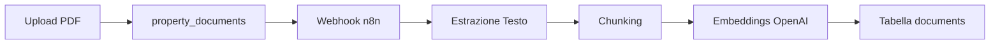

# Integrazione Sistema di Vectorizzazione Documenti

## Panoramica

Il sistema di vectorizzazione permette di convertire automaticamente i documenti PDF caricati nelle proprietà in vettori per permettere ricerche semantiche avanzate.

## Flusso di Funzionamento



## Componenti Principali

### 1. Upload di Documenti
- I documenti vengono caricati normalmente tramite `documentService.uploadDocument()`
- Vengono salvati nella tabella `property_documents`
- Se il documento è un PDF, viene automaticamente inviato al webhook per la vectorizzazione

### 2. Webhook n8n
- URL: `https://n8n.hosthelperai.com/webhook/ae51ae9c-6f4a-484c-acb0-718ae6188d25/pdf`
- Riceve il payload con URL del PDF e metadati
- Processa il documento per estrarre il testo
- Divide il testo in chunks
- Genera embeddings con OpenAI
- Salva nella tabella `documents`

### 3. Tabella Documents
- `id`: ID del chunk
- `property_id`: ID della proprietà
- `property_name`: Nome della proprietà (sincronizzato automaticamente)
- `content`: Testo del chunk
- `metadata`: Metadati del documento (file_id, page_number, etc.)
- `embedding`: Vettore di 1536 dimensioni per ricerca semantica

## Configurazione

### 1. Variabili d'Ambiente
```bash
# Nel file .env
VITE_N8N_WEBHOOK_URL=https://n8n.hosthelperai.com/webhook/ae51ae9c-6f4a-484c-acb0-718ae6188d25/pdf
```

### 2. Webhook n8n
Il workflow n8n deve essere configurato con:
- **Webhook**: per ricevere i PDF
- **Default Data Loader**: per elaborare i file PDF
- **Recursive Character Text Splitter**: per dividere il testo
- **Embeddings OpenAI**: per generare i vettori
- **Supabase Vector Store**: per salvare nella tabella `documents`

## API e Funzioni Disponibili

### Funzioni SQL
```sql
-- Cercare documenti simili
SELECT * FROM match_documents(
  query_embedding, 
  match_count, 
  filter
);

-- Ottenere statistiche
SELECT * FROM get_vectorization_stats(property_id);

-- Documenti in attesa di vectorizzazione
SELECT * FROM get_documents_for_vectorization(property_id);
```

### Servizi TypeScript
```typescript
import { DocumentVectorizationService } from './documentVectorizationService';

// Inviare documento per vectorizzazione
await DocumentVectorizationService.sendDocumentForVectorization({
  fileUrl: 'https://...',
  propertyId: 'uuid',
  propertyName: 'Casa al Mare',
  fileId: 'doc-uuid'
});

// Cercare documenti (richiede embedding della query)
const results = await DocumentVectorizationService.searchDocuments(
  queryEmbedding,
  10,
  { property_id: 'uuid' }
);

// Ottenere statistiche
const stats = await DocumentVectorizationService.getVectorizationStats('uuid');
```

## Test e Verifica

### 1. Script di Test
```bash
node scripts/test-document-vectorization.js
```

### 2. Verifica Manuale
1. Caricare un documento PDF tramite l'interfaccia web
2. Controllare i log del browser per il messaggio di invio al webhook
3. Verificare nella tabella `documents` che i chunks siano stati creati
4. Testare la ricerca semantica con `match_documents`

### 3. Controllo Database
```sql
-- Verificare documenti vectorizzati
SELECT 
  d.property_name,
  COUNT(*) as chunks_count,
  d.metadata->>'file_id' as original_file_id
FROM documents d
GROUP BY d.property_name, d.metadata->>'file_id';

-- Verificare processo di vectorizzazione
SELECT 
  pd.name as document_name,
  pd.property_id,
  COUNT(d.id) as chunks_created
FROM property_documents pd
LEFT JOIN documents d ON d.metadata->>'file_id' = pd.id::text
WHERE pd.file_type = 'pdf'
GROUP BY pd.id, pd.name, pd.property_id;
```

## Risoluzione Problemi

### Il documento non viene vectorizzato
1. Verificare che il file sia un PDF (`file_type = 'pdf'`)
2. Controllare che l'URL del webhook sia corretto
3. Verificare i log del browser per errori
4. Controllare che n8n sia attivo e raggiungibile

### Ricerca non restituisce risultati
1. Verificare che l'embedding della query abbia 1536 dimensioni
2. Controllare che ci siano documenti nella tabella `documents`
3. Verificare i filtri applicati nella ricerca

### Performance Lente
1. Verificare gli indici sulla tabella `documents`
2. Considerare l'ottimizzazione del parametro `lists` dell'indice IVFFlat
3. Limitare i risultati della ricerca con `match_count`

## Sicurezza

- RLS abilitato sulla tabella `documents`
- Gli utenti vedono solo documenti delle loro proprietà
- Service role può gestire tutti i documenti (per n8n)
- Triggers automatici mantengono sincronizzato `property_name`

## Monitoraggio

### Statistiche Utili
```sql
-- Documenti totali vs vectorizzati
SELECT 
  COUNT(*) FILTER (WHERE file_type = 'pdf') as total_pdfs,
  COUNT(DISTINCT d.metadata->>'file_id') as vectorized_pdfs,
  AVG(chunks_per_doc.chunk_count) as avg_chunks_per_doc
FROM property_documents pd
LEFT JOIN (
  SELECT 
    metadata->>'file_id' as file_id,
    COUNT(*) as chunk_count
  FROM documents 
  GROUP BY metadata->>'file_id'
) chunks_per_doc ON chunks_per_doc.file_id = pd.id::text
LEFT JOIN documents d ON d.metadata->>'file_id' = pd.id::text;
```

### Log da Monitorare
- Upload di documenti PDF
- Invii al webhook n8n
- Errori di vectorizzazione
- Performance delle ricerche semantiche 