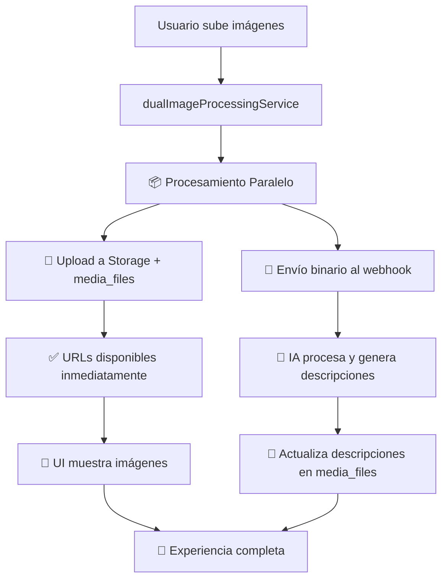

# Implementación del Flujo Dual de Procesamiento de Imágenes

## 📋 Resumen

Se ha implementado un **flujo dual** para el procesamiento de imágenes que permite:

1. **🏪 Subida inmediata** a Supabase Storage + tabla `media_files` (URLs disponibles al instante)
2. **🤖 Procesamiento IA** enviando archivos binarios al webhook n8n (activación de automatización)
3. **📝 Actualización de descripciones** desde la respuesta del webhook

## 🔄 Flujo de Datos



## 🛠️ Implementación Técnica

### Nuevo Servicio: `dualImageProcessingService.ts`

#### Método Principal
```typescript
async processImagesForProperty(
  propertyId: string,
  propertyName: string,
  imageFiles: File[],
  callbacks?: DualProcessingCallbacks
): Promise<MediaFileRecord[]>
```

#### Flujo Interno
```typescript
// PASO 1: Procesamiento paralelo
const [mediaFileRecords, webhookResponse] = await Promise.all([
  this.uploadToStorageAndMediaFiles(propertyId, imageFiles), // Storage + BD
  this.sendBinariesToWebhook(propertyId, propertyName, imageFiles) // Webhook
]);

// PASO 2: Actualizar descripciones
const finalRecords = await this.updateDescriptionsFromWebhook(
  mediaFileRecords, 
  webhookResponse
);
```

## 📊 Ventajas del Flujo Dual

### ⚡ **Velocidad**
- Procesamiento paralelo reduce tiempo total
- URLs disponibles inmediatamente para la UI
- No hay espera secuencial

### 🎯 **Precisión** 
- Webhook recibe archivos binarios originales
- Mejor calidad para el procesamiento de IA
- Sin pérdida de información

### 🔄 **Robustez**
- Si falla el webhook, las imágenes ya están guardadas
- Recuperación automática y reintentos
- Datos seguros en Supabase Storage

### 📱 **UX Mejorada**
- Usuario ve las imágenes inmediatamente
- Progreso en tiempo real
- Descripciones se actualizan sin recargar

## 🗂️ Estructura de Datos

### Tabla `media_files` 
```sql
-- Campos clave para el flujo dual
property_id              -- Vinculación con propiedad
file_type: 'image'       -- Tipo de archivo
file_url                 -- URL pública de Supabase Storage
public_url               -- URL para compartir
description              -- Inicialmente vacío, actualizado por IA
ai_description_status    -- 'pending' → 'completed'/'failed'
processing_status        -- Estado del procesamiento dual
```

### Respuesta del Webhook
```typescript
interface WebhookImageResponse {
  success: boolean;
  processed_images?: Array<{
    filename: string;
    ai_description?: string;
    processing_status: 'completed' | 'failed';
    error_message?: string;
  }>;
  error?: string;
}
```

## 🧪 Testing

### Script de Prueba
```bash
# Test básico con imagen generada
node scripts/test-dual-image-processing.js

# Test con imagen específica
node scripts/test-dual-image-processing.js /path/to/image.jpg
```

### Fases del Test
1. **📦 Storage Upload**: Verifica subida a Supabase + registro en media_files
2. **🚀 Webhook Send**: Prueba envío binario al webhook n8n
3. **📝 Description Update**: Confirma actualización de descripciones

## 🔧 Integración

### PropertyManagementPage.tsx
```typescript
// Antes (solo webhook)
await directImageWebhookService.sendImagesToWebhook(...)

// Ahora (flujo dual)
await dualImageProcessingService.processImagesForProperty(...)
```

### Callbacks Mejorados
```typescript
{
  onProgress: (message, percent) => {
    // "Subiendo a storage..." → "Enviando al webhook..." → "Actualizando descripciones..."
  },
  onStatusChange: (status) => {
    // 'preparing' → 'uploading' → 'sending' → 'updating' → 'completed'
  },
  onSuccess: (results) => {
    // Array de MediaFileRecord con URLs y descripciones
  }
}
```

## 🚀 Beneficios del Usuario

### Para el Usuario Final
- ✅ **Inmediatez**: Ve sus imágenes subidas al instante
- ✅ **Transparencia**: Progreso claro del procesamiento
- ✅ **Confiabilidad**: Las imágenes nunca se pierden
- ✅ **Inteligencia**: Descripciones automáticas mejoradas

### Para el Desarrollador
- ✅ **Simplicidad**: Un solo método para todo el flujo
- ✅ **Flexibilidad**: Manejo independiente de errores
- ✅ **Escalabilidad**: Procesamiento paralelo eficiente
- ✅ **Debugging**: Logs detallados para cada fase

## 📋 Estados del Procesamiento

| Estado | Descripción | Acción del Usuario |
|--------|-------------|-------------------|
| `pending` | Imagen subida, esperando IA | ✅ Puede ver la imagen |
| `completed` | IA procesó con éxito | ✅ Ve imagen + descripción |
| `failed` | Error en procesamiento IA | ✅ Ve imagen sin descripción |

## 🔄 Migración desde Servicios Anteriores

### ❌ Servicios Obsoletos
- `directImageWebhookService` → Solo webhook, sin storage
- `imageWebhookService` → Solo storage + webhook secuencial

### ✅ Servicio Nuevo
- `dualImageProcessingService` → Storage + webhook paralelo + actualización

## 🎯 Resultado Final

El usuario experimenta:
1. **📤 Subida instantánea**: Ve sus imágenes inmediatamente 
2. **🤖 IA en segundo plano**: El webhook procesa sin interrumpir
3. **📝 Mejora automática**: Las descripciones aparecen cuando están listas
4. **🔄 Experiencia fluida**: Sin recargas ni esperas innecesarias

¡El flujo dual combina lo mejor de ambos mundos: **velocidad** e **inteligencia**! 🎉 