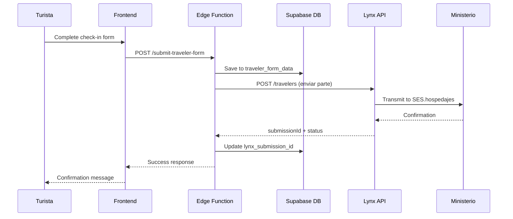

# Lynx Check-in Integration Guide

## 📖 Descripción General

Lynx Check-in es un proveedor de cumplimiento del **Real Decreto 933/2021** para el registro de viajeros. Esta integración permite enviar automáticamente los datos de viajeros al Ministerio del Interior de España a través de su plataforma.

### ¿Qué hace Lynx Check-in?

- ✅ Recibe datos de viajeros desde nuestra aplicación
- ✅ Los valida según normativa española
- ✅ Los envía a SES.hospedajes (Ministerio del Interior)
- ✅ Gestiona las respuestas y confirmaciones
- ✅ Almacena copias cifradas por 3 años (obligación legal)
- ✅ Permite modificar/anular partes ya enviados

---

## 🔌 API de Partners - Estructura

### Base URL
```
https://vlmfxh4pka.execute-api.eu-south-2.amazonaws.com/partners-api/v1
```

### Endpoints Principales

#### 1. Listar Alojamientos
```http
GET /accounts/{accountId}/lodgings
```

**Respuesta:**
```json
{
  "lodgings": [
    {
      "id": "3dfc0644-612d-4449-9dd6-de7a9d15b012",
      "accountId": "a190fff8-c5d0-49a2-80a8-79b38ce0f284",
      "authConnId": "18b8c296-5ffb-4015-a5e9-8e0fb5050dc4",
      "name": "Cabaña Mirlo Blanco",
      "establishment": {
        "name": "Cabaña Mirlo Blanco",
        "type": "apartment",
        "address": "Calle ejemplo 123",
        "city": "Madrid",
        "province": "Madrid",
        "country": "ES"
      }
    }
  ]
}
```

#### 2. Crear Parte de Viajero (Supuesto)
```http
POST /accounts/{accountId}/lodgings/{lodgingId}/travelers
```

**Payload esperado:**
```json
{
  "checkInDate": "2025-03-04",
  "checkOutDate": "2025-03-18",
  "travelers": [
    {
      "firstName": "Juan",
      "lastName": "García López",
      "documentType": "DNI",
      "documentNumber": "12345678A",
      "nationality": "ES",
      "birthDate": "1990-01-15",
      "gender": "M",
      "email": "juan@example.com",
      "phone": "+34600123456",
      "address": {
        "street": "Calle Mayor 1",
        "city": "Madrid",
        "postalCode": "28001",
        "country": "ES"
      }
    }
  ],
  "signature": "data:image/png;base64,...",
  "paymentMethod": "CASH"
}
```

**Respuesta:**
```json
{
  "success": true,
  "submissionId": "abc123...",
  "status": "submitted",
  "submittedAt": "2025-03-04T10:30:00Z",
  "sesResponse": {
    "partId": "SES-2025-001234",
    "accepted": true
  }
}
```

---

## 🗺️ Mapeo de Datos

### De Host Helper a Lynx Check-in

| Host Helper | Lynx Check-in | Notas |
|-------------|---------------|-------|
| `first_name` | `firstName` | Direct mapping |
| `last_name` | `lastName` | Concatenar apellidos |
| `document_type` | `documentType` | DNI/NIE/PASSPORT |
| `document_number` | `documentNumber` | Direct mapping |
| `nationality` | `nationality` | ISO Alpha-2 |
| `birth_date` | `birthDate` | Format: YYYY-MM-DD |
| `gender` | `gender` | M/F/Other → M/F/X |
| `email` | `email` | Direct mapping |
| `phone` | `phone` | Include country code |
| `address_street` | `address.street` | Direct mapping |
| `address_city` | `address.city` | Direct mapping |
| `address_postal_code` | `address.postalCode` | Direct mapping |
| `address_country` | `address.country` | ISO Alpha-2 |
| `signature_data` | `signature` | Base64 PNG |
| `payment_method` | `paymentMethod` | CASH/CARD/TRANS |

---

## 🏗️ Arquitectura de Integración

### Flujo Completo



### Componentes Necesarios

1. **Servicio Frontend** (`lynxCheckinService.ts`)
   - Abstrae llamadas a Lynx API
   - Maneja autenticación y headers
   - Retry logic y error handling

2. **Edge Function Modificada** (`submit-traveler-form`)
   - Guardar en BD (actual)
   - **NUEVO:** Enviar a Lynx API
   - Guardar respuesta de Lynx

3. **Migración de BD**
   - Añadir `lynx_lodging_id` a `properties`
   - Índice para búsqueda rápida

4. **Herramienta de Sincronización**
   - Listar lodgings de Lynx
   - Mapear con properties existentes
   - Dashboard para gestores

---

## 🔐 Autenticación y Seguridad

### Credenciales Necesarias

Variables de entorno a configurar:

```env
# Lynx Check-in API
VITE_LYNX_ACCOUNT_ID=a190fff8-c5d0-49a2-80a8-79b38ce0f284
LYNX_API_KEY=YOUR_API_KEY_HERE  # Server-side only
LYNX_API_URL=https://vlmfxh4pka.execute-api.eu-south-2.amazonaws.com/partners-api/v1
```

⚠️ **IMPORTANTE:**
- `LYNX_API_KEY` NUNCA debe estar en el frontend
- Solo usar en Edge Functions o backend
- Usar Supabase Secrets para almacenamiento seguro

### Configurar Secrets en Supabase

```bash
# Via CLI
supabase secrets set LYNX_API_KEY=your-secret-key
supabase secrets set LYNX_ACCOUNT_ID=a190fff8-c5d0-49a2-80a8-79b38ce0f284

# Via Dashboard
# Settings > Edge Functions > Secrets
```

---

## 📦 Implementación

### Paso 1: Servicio de API

Crear `src/services/lynxCheckinService.ts`:

```typescript
/**
 * Lynx Check-in API Service
 * Comunicación con la API de Partners de Lynx Check-in
 */

const LYNX_API_URL = import.meta.env.VITE_LYNX_API_URL;
const LYNX_ACCOUNT_ID = import.meta.env.VITE_LYNX_ACCOUNT_ID;

export interface LynxLodging {
  id: string;
  accountId: string;
  authConnId: string;
  name: string;
  establishment: {
    name: string;
    type: string;
    address: string;
    city: string;
    province: string;
    country: string;
  };
}

export interface LynxTravelerData {
  checkInDate: string;
  checkOutDate: string;
  travelers: Array<{
    firstName: string;
    lastName: string;
    documentType: string;
    documentNumber: string;
    nationality: string;
    birthDate: string;
    gender: string;
    email: string;
    phone: string;
    address: {
      street: string;
      city: string;
      postalCode: string;
      country: string;
    };
  }>;
  signature: string;
  paymentMethod: string;
}

export interface LynxSubmissionResponse {
  success: boolean;
  submissionId: string;
  status: string;
  submittedAt: string;
  sesResponse?: {
    partId: string;
    accepted: boolean;
  };
  error?: string;
}

class LynxCheckinService {
  /**
   * Lista todos los alojamientos registrados en Lynx
   * Solo debe llamarse desde servidor (Edge Function)
   */
  async listLodgings(apiKey: string): Promise<LynxLodging[]> {
    const response = await fetch(
      `${LYNX_API_URL}/accounts/${LYNX_ACCOUNT_ID}/lodgings`,
      {
        headers: {
          'Authorization': `Bearer ${apiKey}`,
          'Content-Type': 'application/json',
        },
      }
    );

    if (!response.ok) {
      throw new Error(`Lynx API error: ${response.status}`);
    }

    const data = await response.json();
    return data.lodgings || [];
  }

  /**
   * Envía un parte de viajero a Lynx Check-in
   * Solo debe llamarse desde servidor (Edge Function)
   */
  async submitTravelerData(
    apiKey: string,
    lodgingId: string,
    travelerData: LynxTravelerData
  ): Promise<LynxSubmissionResponse> {
    const response = await fetch(
      `${LYNX_API_URL}/accounts/${LYNX_ACCOUNT_ID}/lodgings/${lodgingId}/travelers`,
      {
        method: 'POST',
        headers: {
          'Authorization': `Bearer ${apiKey}`,
          'Content-Type': 'application/json',
        },
        body: JSON.stringify(travelerData),
      }
    );

    const data = await response.json();

    if (!response.ok) {
      return {
        success: false,
        submissionId: '',
        status: 'error',
        submittedAt: new Date().toISOString(),
        error: data.message || 'Error al enviar a Lynx Check-in',
      };
    }

    return {
      success: true,
      ...data,
    };
  }

  /**
   * Mapea datos de Host Helper a formato Lynx
   */
  mapHostHelperToLynx(
    travelerFormData: any[],
    checkInDate: string,
    checkOutDate: string,
    signatureData: string,
    paymentMethod: string
  ): LynxTravelerData {
    return {
      checkInDate,
      checkOutDate,
      travelers: travelerFormData.map(t => ({
        firstName: t.first_name,
        lastName: t.last_name,
        documentType: t.document_type,
        documentNumber: t.document_number,
        nationality: t.nationality,
        birthDate: t.birth_date,
        gender: t.gender === 'M' ? 'M' : t.gender === 'F' ? 'F' : 'X',
        email: t.email,
        phone: t.phone || '',
        address: {
          street: t.address_street,
          city: t.address_city,
          postalCode: t.address_postal_code,
          country: t.address_country,
        },
      })),
      signature: signatureData,
      paymentMethod,
    };
  }
}

export const lynxCheckinService = new LynxCheckinService();
```

### Paso 2: Migración de Base de Datos

Añadir campo para mapear properties con lodgings:

```sql
-- Add lynx_lodging_id to properties table
ALTER TABLE properties
ADD COLUMN lynx_lodging_id TEXT;

-- Add index for fast lookup
CREATE INDEX idx_properties_lynx_lodging_id 
ON properties(lynx_lodging_id);

-- Add comment for documentation
COMMENT ON COLUMN properties.lynx_lodging_id IS 
'ID del alojamiento en Lynx Check-in. Mapea esta propiedad con un lodging en Lynx para enviar partes de viajero.';
```

### Paso 3: Modificar Edge Function

Actualizar `supabase/functions/submit-traveler-form/index.ts`:

```typescript
// ... existing imports ...
import { lynxCheckinService } from '../_shared/lynxCheckinService.ts';

serve(async (req) => {
  // ... existing validation ...

  // After inserting traveler data successfully...

  // 1. Get all travelers for this form
  const { data: allTravelers } = await supabase
    .from('traveler_form_data')
    .select('*')
    .eq('form_request_id', request.id);

  if (!allTravelers || allTravelers.length === 0) {
    // No travelers yet, skip Lynx submission
    return successResponse;
  }

  // 2. Get property to find lynx_lodging_id
  const { data: property } = await supabase
    .from('properties')
    .select('lynx_lodging_id')
    .eq('id', request.property_id)
    .single();

  if (!property?.lynx_lodging_id) {
    console.warn(`Property ${request.property_id} no tiene lynx_lodging_id configurado`);
    // Don't fail - just log and continue
    return successResponse;
  }

  // 3. Prepare Lynx payload
  const lynxApiKey = Deno.env.get('LYNX_API_KEY')!;
  const lynxPayload = lynxCheckinService.mapHostHelperToLynx(
    allTravelers,
    request.check_in_date,
    request.check_out_date,
    allTravelers[0].signature_data, // Use first traveler's signature
    allTravelers[0].payment_method || 'CASH'
  );

  // 4. Submit to Lynx
  try {
    const lynxResponse = await lynxCheckinService.submitTravelerData(
      lynxApiKey,
      property.lynx_lodging_id,
      lynxPayload
    );

    // 5. Update request with Lynx response
    await supabase
      .from('traveler_form_requests')
      .update({
        lynx_submission_id: lynxResponse.submissionId,
        lynx_submitted_at: lynxResponse.submittedAt,
        lynx_payload: lynxPayload,
        lynx_response: lynxResponse,
      })
      .eq('id', request.id);

    console.log(`✅ Enviado a Lynx: ${lynxResponse.submissionId}`);
  } catch (error) {
    console.error('❌ Error enviando a Lynx:', error);
    // Don't fail the request - data is saved in our DB
    // Gestor can retry manually from dashboard
  }

  return successResponse;
});
```

### Paso 4: Herramienta de Sincronización

Crear página para gestores que mapee properties con lodgings:

```typescript
// src/features/properties/components/LynxSyncTool.tsx
import React, { useState, useEffect } from 'react';
import { supabase } from '@/services/supabase';

export const LynxSyncTool: React.FC = () => {
  const [properties, setProperties] = useState([]);
  const [lodgings, setLodgings] = useState([]);
  const [loading, setLoading] = useState(true);

  useEffect(() => {
    loadData();
  }, []);

  const loadData = async () => {
    // Load properties
    const { data: props } = await supabase
      .from('properties')
      .select('id, name, lynx_lodging_id');
    
    // Call Edge Function to get Lynx lodgings
    const { data: lynxData } = await supabase.functions.invoke('lynx-list-lodgings');
    
    setProperties(props || []);
    setLodgings(lynxData?.lodgings || []);
    setLoading(false);
  };

  const linkPropertyToLodging = async (propertyId: string, lodgingId: string) => {
    await supabase
      .from('properties')
      .update({ lynx_lodging_id: lodgingId })
      .eq('id', propertyId);
    
    await loadData();
  };

  return (
    <div className="p-6">
      <h2 className="text-2xl font-bold mb-4">
        Sincronizar Propiedades con Lynx Check-in
      </h2>
      
      <div className="grid gap-4">
        {properties.map(prop => (
          <div key={prop.id} className="border p-4 rounded">
            <h3 className="font-bold">{prop.name}</h3>
            <select
              value={prop.lynx_lodging_id || ''}
              onChange={(e) => linkPropertyToLodging(prop.id, e.target.value)}
              className="mt-2 w-full border rounded px-3 py-2"
            >
              <option value="">-- Seleccionar Lodging --</option>
              {lodgings.map(lodging => (
                <option key={lodging.id} value={lodging.id}>
                  {lodging.name}
                </option>
              ))}
            </select>
            {prop.lynx_lodging_id && (
              <span className="text-green-600 text-sm">✓ Vinculado</span>
            )}
          </div>
        ))}
      </div>
    </div>
  );
};
```

---

## 🧪 Testing

### 1. Test de Conexión

```bash
# Test listar lodgings
curl https://vlmfxh4pka.execute-api.eu-south-2.amazonaws.com/partners-api/v1/accounts/a190fff8-c5d0-49a2-80a8-79b38ce0f284/lodgings \
  -H "Authorization: Bearer YOUR_API_KEY"
```

### 2. Test de Envío (Mock)

Primero prueba con datos de test antes de enviar al Ministerio.

### 3. Checklist de Validación

- [ ] Lodgings se listan correctamente
- [ ] Properties se mapean con lodgings
- [ ] Formulario de viajero se completa
- [ ] Datos se guardan en BD Host Helper
- [ ] Datos se envían a Lynx
- [ ] Respuesta de Lynx se guarda
- [ ] Error handling funciona

---

## 🚨 Manejo de Errores

### Casos a Manejar

1. **Lynx API caída**: Guardar en BD, reintentar después
2. **Property sin lynx_lodging_id**: Notificar al gestor
3. **Datos inválidos**: Validar antes de enviar
4. **Timeout**: Configurar reintentos automáticos

### Estrategia de Reintentos

```typescript
const retrySubmission = async (requestId: string) => {
  // Get request data
  const { data: request } = await supabase
    .from('traveler_form_requests')
    .select('*, traveler_form_data(*)')
    .eq('id', requestId)
    .single();
  
  // Retry submission to Lynx
  // ... logic ...
};
```

---

## 📊 Dashboard de Gestores

Añadir indicadores visuales:

- ✅ **Enviado a Lynx**: Verde con submissionId
- ⏳ **Pendiente**: Amarillo, botón "Reenviar"
- ❌ **Error**: Rojo, botón "Reintentar"

---

## 📚 Documentación Lynx

**Contacto Soporte:**
- Email: soporte@lynxcheckin.com
- Web: https://www.lynxcheckin.com/es

**Solicitar:**
- Documentación completa de Partners API
- API Key de producción
- Webhooks disponibles
- Rate limits

---

## ✅ Checklist de Implementación

- [ ] Obtener API Key de Lynx
- [ ] Configurar Supabase Secrets
- [ ] Crear servicio `lynxCheckinService.ts`
- [ ] Ejecutar migración de BD
- [ ] Crear Edge Function `lynx-list-lodgings`
- [ ] Modificar `submit-traveler-form`
- [ ] Crear herramienta de sincronización
- [ ] Testing end-to-end
- [ ] Deploy a producción

---

**Última actualización:** 2025-10-29  
**Versión API:** v1  
**Estado:** En implementación


