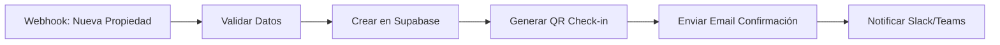
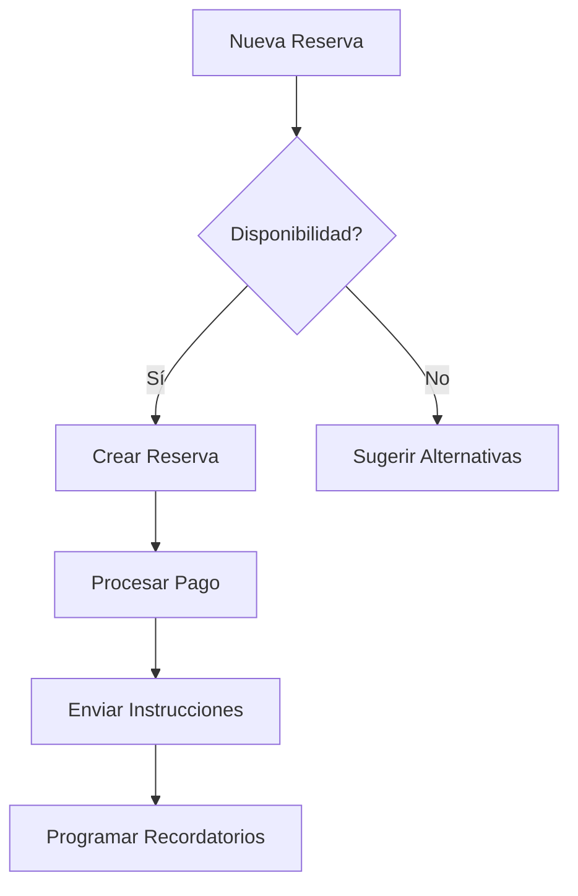
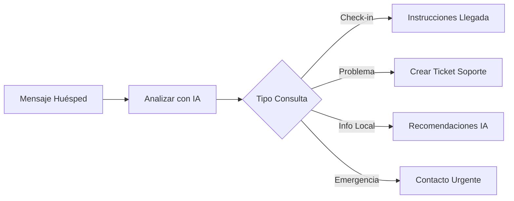

# Host Helper AI - Integración con n8n

**Última actualización:** Junio 2025

## Visión General

Host Helper AI utiliza n8n como plataforma de automatización y agentes de IA para gestionar tareas inteligentes en la gestión de propiedades. Esta integración reemplaza la anterior implementación con Botpress.

## ¿Por qué n8n?

- **✅ Automatización visual:** Workflows fáciles de crear y mantener
- **✅ IA integrada:** Soporte nativo para LLMs y agentes inteligentes
- **✅ Conectores múltiples:** Integración directa con Supabase, Stripe, email
- **✅ Auto-hosting:** Control total sobre datos y procesos
- **✅ Escalabilidad:** Procesamiento asíncrono y paralelo

## Requisitos Previos

### Software Necesario
```bash
# Node.js 18+ (recomendado: 20.x)
node --version

# Docker (para instalación containerizada)
docker --version

# npm o yarn
npm --version
```

### Configuración del Entorno
```bash
# Variables de entorno requeridas
VITE_N8N_WEBHOOK_URL=https://tu-instancia-n8n.com/webhook
VITE_N8N_API_KEY=tu_api_key_n8n
VITE_N8N_INSTANCE_URL=https://tu-instancia-n8n.com
```

## Instalación de n8n

### Opción 1: Docker (Recomendado)
```bash
# Crear directorio para n8n
mkdir n8n-data

# Ejecutar n8n con Docker
docker run -it --rm \
  --name n8n \
  -p 5678:5678 \
  -v ~/.n8n:/home/node/.n8n \
  n8nio/n8n
```

### Opción 2: Instalación Local
```bash
# Instalación global
npm install n8n -g

# Ejecutar n8n
n8n start
```

### Opción 3: Cloud (Producción)
```bash
# Para entornos de producción, usar n8n Cloud
# Registrarse en: https://n8n.cloud
# Configurar webhook URLs en variables de entorno
```

## Configuración Base

### 1. Configuración de Webhooks

#### En n8n:
1. Crear workflow nuevo
2. Agregar nodo "Webhook"
3. Configurar:
   - **HTTP Method:** POST
   - **Path:** `host-helper-ai/property-events`
   - **Authentication:** Header Auth

#### En Host Helper AI:
```typescript
// src/config/n8n.ts
export const n8nConfig = {
  webhookUrl: import.meta.env.VITE_N8N_WEBHOOK_URL,
  apiKey: import.meta.env.VITE_N8N_API_KEY,
  instanceUrl: import.meta.env.VITE_N8N_INSTANCE_URL,
  webhooks: {
    propertyCreated: '/webhook/property-created',
    reservationMade: '/webhook/reservation-made',
    guestCheckin: '/webhook/guest-checkin',
    paymentReceived: '/webhook/payment-received'
  }
};
```

### 2. Configuración de Credenciales

#### Supabase en n8n:
```json
{
  "host": "tu-proyecto.supabase.co",
  "database": "postgres",
  "username": "postgres",
  "password": "tu_password_supabase",
  "ssl": true
}
```

#### Stripe en n8n:
```json
{
  "secretKey": "sk_live_...", // o sk_test_ para desarrollo
  "apiVersion": "2023-10-16"
}
```

## Workflows Principales

### 1. Gestión de Propiedades

#### Workflow: `property-management`


#### Configuración:
```json
{
  "name": "Property Management",
  "nodes": [
    {
      "name": "Webhook",
      "type": "n8n-nodes-base.webhook",
      "parameters": {
        "path": "property-created",
        "httpMethod": "POST"
      }
    },
    {
      "name": "Supabase Insert",
      "type": "n8n-nodes-base.supabase",
      "parameters": {
        "operation": "insert",
        "table": "properties"
      }
    }
  ]
}
```

### 2. Gestión de Reservas Inteligente

#### Workflow: `smart-reservation-management`


### 3. Asistente IA para Huéspedes

#### Workflow: `guest-ai-assistant`


## Implementación en Host Helper AI

### 1. Servicio de n8n

```typescript
// src/services/n8nService.ts
import { n8nConfig } from '../config/n8n';

class N8nService {
  private baseUrl: string;
  private apiKey: string;

  constructor() {
    this.baseUrl = n8nConfig.instanceUrl;
    this.apiKey = n8nConfig.apiKey;
  }

  async triggerWorkflow(workflowId: string, data: any) {
    try {
      const response = await fetch(`${this.baseUrl}/api/v1/workflows/${workflowId}/execute`, {
        method: 'POST',
        headers: {
          'Content-Type': 'application/json',
          'X-N8N-API-KEY': this.apiKey
        },
        body: JSON.stringify(data)
      });

      return await response.json();
    } catch (error) {
      console.error('Error ejecutando workflow n8n:', error);
      throw error;
    }
  }

  async sendWebhook(endpoint: string, data: any) {
    try {
      const response = await fetch(`${n8nConfig.webhookUrl}${endpoint}`, {
        method: 'POST',
        headers: {
          'Content-Type': 'application/json'
        },
        body: JSON.stringify(data)
      });

      return await response.json();
    } catch (error) {
      console.error('Error enviando webhook:', error);
      throw error;
    }
  }
}

export const n8nService = new N8nService();
```

### 2. Hook para Automatizaciones

```typescript
// src/hooks/useN8nAutomation.ts
import { useState } from 'react';
import { n8nService } from '../services/n8nService';

export const useN8nAutomation = () => {
  const [loading, setLoading] = useState(false);
  const [error, setError] = useState<string | null>(null);

  const triggerPropertyCreation = async (propertyData: any) => {
    setLoading(true);
    setError(null);
    
    try {
      await n8nService.sendWebhook('/property-created', {
        property: propertyData,
        timestamp: new Date().toISOString(),
        source: 'host-helper-ai'
      });
    } catch (err) {
      setError('Error activando automatización de propiedad');
    } finally {
      setLoading(false);
    }
  };

  const triggerReservationFlow = async (reservationData: any) => {
    setLoading(true);
    setError(null);
    
    try {
      await n8nService.sendWebhook('/reservation-made', {
        reservation: reservationData,
        timestamp: new Date().toISOString(),
        source: 'host-helper-ai'
      });
    } catch (err) {
      setError('Error activando flujo de reserva');
    } finally {
      setLoading(false);
    }
  };

  return {
    loading,
    error,
    triggerPropertyCreation,
    triggerReservationFlow
  };
};
```

### 3. Integración en Componentes

```typescript
// src/features/properties/components/PropertyForm.tsx
import { useN8nAutomation } from '../../../hooks/useN8nAutomation';

export const PropertyForm = () => {
  const { triggerPropertyCreation, loading: automationLoading } = useN8nAutomation();

  const handleSubmit = async (propertyData: PropertyInput) => {
    try {
      // Crear propiedad en Supabase
      const newProperty = await propertyService.create(propertyData);
      
      // Activar automatización en n8n
      await triggerPropertyCreation(newProperty);
      
      // Mostrar éxito
      toast.success('Propiedad creada y automatización activada');
    } catch (error) {
      toast.error('Error creando propiedad');
    }
  };

  return (
    <form onSubmit={handleSubmit}>
      {/* Campos del formulario */}
      <button type="submit" disabled={automationLoading}>
        {automationLoading ? 'Procesando...' : 'Crear Propiedad'}
      </button>
    </form>
  );
};
```

## Monitoreo y Logging

### 1. Dashboard de n8n
- Acceder a: `http://localhost:5678` (local) o tu URL de n8n Cloud
- Monitorear ejecuciones de workflows
- Ver logs detallados de errores
- Configurar alertas

### 2. Integración con Host Helper AI

```typescript
// src/services/n8nMonitoring.ts
export const n8nMonitoring = {
  async getWorkflowStatus(workflowId: string) {
    // Obtener estado de workflows
  },
  
  async getExecutionLogs(executionId: string) {
    // Obtener logs de ejecución específica
  },
  
  async getMetrics() {
    // Obtener métricas de rendimiento
  }
};
```

## Seguridad

### 1. Autenticación
```bash
# Variables de entorno seguras
N8N_BASIC_AUTH_ACTIVE=true
N8N_BASIC_AUTH_USER=admin
N8N_BASIC_AUTH_PASSWORD=tu_password_seguro

# JWT para APIs
N8N_JWT_AUTH_ACTIVE=true
N8N_JWT_AUTH_HEADER=authorization
```

### 2. Webhook Security
```typescript
// Validación de webhooks
const validateWebhook = (req: Request) => {
  const signature = req.headers['x-n8n-signature'];
  const payload = JSON.stringify(req.body);
  const expectedSignature = crypto
    .createHmac('sha256', process.env.N8N_WEBHOOK_SECRET!)
    .update(payload)
    .digest('hex');
    
  return signature === expectedSignature;
};
```

## Próximos Pasos

1. **Instalar n8n** según el método elegido
2. **Configurar variables de entorno** en Host Helper AI
3. **Importar workflows básicos** desde los ejemplos
4. **Probar integración** con datos de desarrollo
5. **Configurar monitoreo** y alertas
6. **Implementar en producción**

## Soporte y Recursos

- **Documentación oficial n8n:** https://docs.n8n.io/
- **Community Forum:** https://community.n8n.io/
- **Discord:** https://discord.gg/n8n
- **Repositorio GitHub:** https://github.com/n8n-io/n8n

---

**⚠️ Importante:** Esta documentación reemplaza completamente las referencias anteriores a Botpress. Todo el sistema de IA y automatización se basa ahora en n8n. 