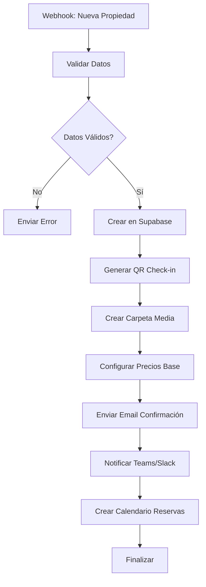
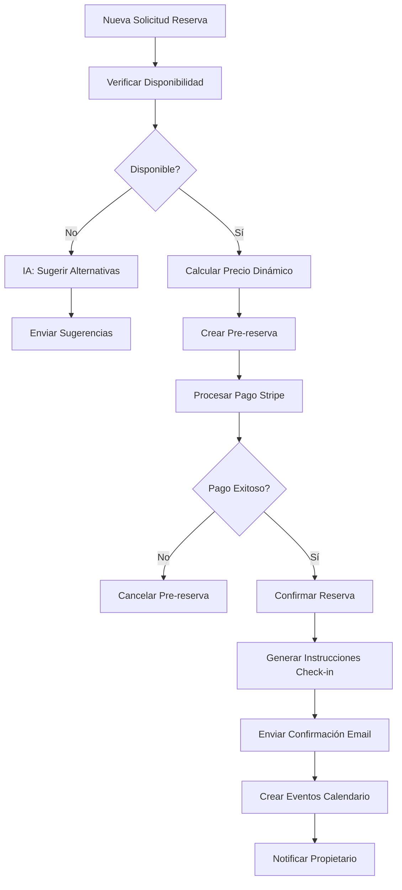
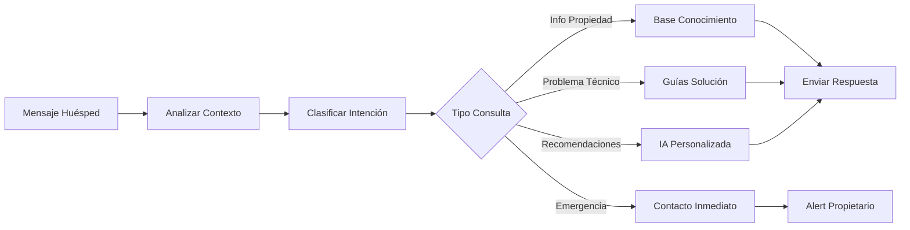
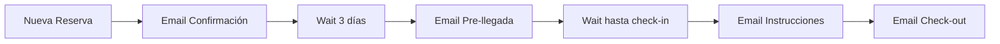
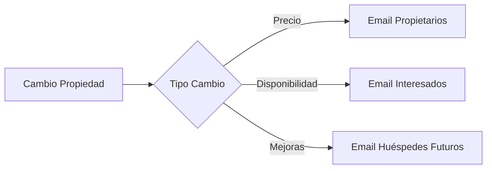
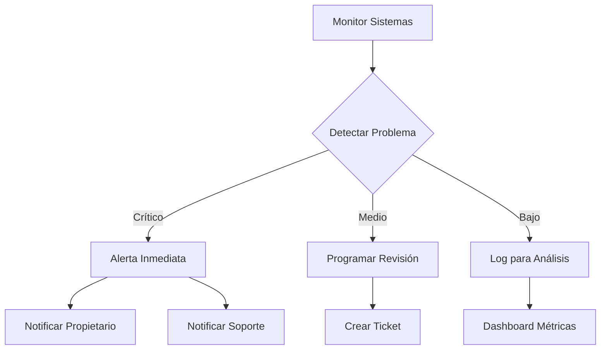

# n8n Workflows para Host Helper AI

**Última actualización:** Junio 2025

## Workflows Implementados

Esta documentación detalla todos los workflows de n8n utilizados en Host Helper AI para automatización y gestión inteligente.

## 1. 🏠 Property Management Workflow

### Descripción
Automatiza la gestión completa de propiedades desde la creación hasta la configuración inicial.

### Trigger
- **Tipo:** Webhook
- **URL:** `/webhook/property-created`
- **Método:** POST

### Flujo del Workflow



### Configuración JSON

```json
{
  "name": "Property Management",
  "nodes": [
    {
      "name": "Property Webhook",
      "type": "n8n-nodes-base.webhook",
      "parameters": {
        "path": "property-created",
        "httpMethod": "POST",
        "responseMode": "responseNode"
      }
    },
    {
      "name": "Validate Property Data",
      "type": "n8n-nodes-base.code",
      "parameters": {
        "jsCode": "// Validación de datos de propiedad\nconst property = $input.first().json;\n\nif (!property.title || !property.address || !property.owner_id) {\n  throw new Error('Datos requeridos faltantes');\n}\n\nreturn [{\n  json: {\n    ...property,\n    validated: true,\n    created_at: new Date().toISOString()\n  }\n}];"
      }
    },
    {
      "name": "Create in Supabase",
      "type": "n8n-nodes-base.supabase",
      "parameters": {
        "operation": "insert",
        "table": "properties",
        "fieldsUi": {
          "fieldValues": [
            {
              "fieldId": "title",
              "fieldValue": "={{ $json.title }}"
            },
            {
              "fieldId": "address",
              "fieldValue": "={{ $json.address }}"
            },
            {
              "fieldId": "owner_id",
              "fieldValue": "={{ $json.owner_id }}"
            }
          ]
        }
      }
    }
  ]
}
```

## 2. 📅 Smart Reservation Management

### Descripción
Gestiona reservas con inteligencia artificial para optimizar disponibilidad y pricing.

### Trigger
- **Tipo:** Webhook
- **URL:** `/webhook/reservation-request`
- **Método:** POST

### Características Principales
- ✅ Verificación automática de disponibilidad
- ✅ Cálculo dinámico de precios
- ✅ Detección de conflictos
- ✅ Sugerencias alternativas con IA
- ✅ Procesamiento de pagos automático

### Flujo del Workflow



### Configuración del Nodo IA

```json
{
  "name": "AI Alternative Suggestions",
  "type": "n8n-nodes-base.openai",
  "parameters": {
    "operation": "text",
    "model": "gpt-4",
    "prompt": "Analiza esta solicitud de reserva rechazada y sugiere 3 alternativas basadas en:\n- Fechas solicitadas: {{ $json.check_in }} - {{ $json.check_out }}\n- Presupuesto: {{ $json.budget }}\n- Huéspedes: {{ $json.guests }}\n- Ubicación deseada: {{ $json.location }}\n\nPropiedades disponibles: {{ $('Get Available Properties').all() }}\n\nResponde en formato JSON con alternativas optimizadas."
  }
}
```

## 3. 🤖 Guest AI Assistant

### Descripción
Asistente IA 24/7 para consultas de huéspedes con respuestas contextúales.

### Trigger
- **Tipo:** Webhook
- **URL:** `/webhook/guest-message`
- **Método:** POST

### Capacidades del Asistente
- 🏠 Información sobre la propiedad
- 🗺️ Recomendaciones locales personalizadas
- 🔧 Resolución de problemas comunes
- 📞 Escalación a soporte humano
- 🚨 Detección de emergencias

### Flujo del Workflow



### Configuración del Procesamiento IA

```json
{
  "name": "Analyze Guest Message",
  "type": "n8n-nodes-base.openai",
  "parameters": {
    "operation": "text",
    "model": "gpt-4",
    "prompt": "Eres el asistente IA de Host Helper AI. Analiza este mensaje de huésped:\n\nMensaje: {{ $json.message }}\nPropiedad: {{ $json.property_name }}\nHuésped: {{ $json.guest_name }}\nFecha estancia: {{ $json.check_in }} - {{ $json.check_out }}\n\nClasifica la intención (info, problema, emergencia, recomendación) y proporciona una respuesta útil y amigable en español.\n\nContexto de la propiedad:\n{{ $('Get Property Info').first().json }}\n\nRespuesta:"
  }
}
```

## 4. 💰 Dynamic Pricing Engine

### Descripción
Sistema de precios dinámicos basado en demanda, temporada y eventos locales.

### Trigger
- **Tipo:** Cron Job
- **Frecuencia:** Diario a las 06:00
- **Backup:** Manual via webhook

### Factores de Precio
- 📊 Demanda histórica
- 📅 Temporada alta/baja
- 🎉 Eventos locales
- 🏨 Precios competencia
- 📈 Ocupación actual

### Algoritmo de Precio

```javascript
// Nodo Code: Calculate Dynamic Price
const basePrice = $json.base_price;
const property = $json.property;
const dates = $json.target_dates;

// Factores de ajuste
const seasonality = getSeasonalityFactor(dates);
const demand = getDemandFactor(property.id, dates);
const events = getLocalEventsFactor(property.location, dates);
const competition = getCompetitionFactor(property.location);

// Cálculo final
const finalPrice = basePrice * seasonality * demand * events * competition;

// Límites de seguridad
const minPrice = basePrice * 0.7; // No menos del 70%
const maxPrice = basePrice * 2.5; // No más del 250%

return [{
  json: {
    property_id: property.id,
    date_range: dates,
    original_price: basePrice,
    calculated_price: Math.max(minPrice, Math.min(maxPrice, finalPrice)),
    factors: {
      seasonality,
      demand,
      events,
      competition
    },
    updated_at: new Date().toISOString()
  }
}];
```

## 5. 📧 Email Automation Suite

### Descripción
Suite completa de automatización de emails para diferentes eventos.

### Workflows Incluidos

#### 5.1 Welcome Series


#### 5.2 Property Updates


### Templates de Email

```html
<!-- Template: Confirmación Reserva -->
<div class="email-template">
  <h1>¡Reserva Confirmada! 🎉</h1>
  <p>Hola {{ guest_name }},</p>
  <p>Tu reserva en <strong>{{ property_name }}</strong> ha sido confirmada.</p>
  
  <div class="reservation-details">
    <h3>Detalles de tu Reserva:</h3>
    <ul>
      <li><strong>Check-in:</strong> {{ check_in_date }}</li>
      <li><strong>Check-out:</strong> {{ check_out_date }}</li>
      <li><strong>Huéspedes:</strong> {{ guest_count }}</li>
      <li><strong>Total:</strong> {{ total_amount }}€</li>
    </ul>
  </div>
  
  <a href="{{ check_in_instructions_url }}" class="cta-button">
    Ver Instrucciones de Llegada
  </a>
</div>
```

## 6. 📊 Analytics & Reporting

### Descripción
Generación automática de reportes y análisis de negocio.

### Reportes Generados
- 📈 Ocupación mensual
- 💰 Revenue por propiedad
- ⭐ Satisfacción huéspedes
- 🔧 Incidencias y resolución
- 📱 Métricas de automatización

### Configuración de Reportes

```json
{
  "name": "Generate Monthly Report",
  "schedule": "0 0 1 * *",
  "nodes": [
    {
      "name": "Get Property Data",
      "type": "n8n-nodes-base.supabase",
      "parameters": {
        "operation": "select",
        "table": "properties",
        "filterUi": {
          "filterValues": [
            {
              "key": "created_at",
              "value": "{{ $now.minus({months: 1}).toISO() }}"
            }
          ]
        }
      }
    },
    {
      "name": "Calculate Metrics",
      "type": "n8n-nodes-base.code",
      "parameters": {
        "jsCode": "// Cálculos de métricas\nconst properties = $input.all();\nconst metrics = {\n  total_revenue: 0,\n  avg_occupancy: 0,\n  total_bookings: 0,\n  satisfaction_score: 0\n};\n\n// Procesamiento de datos...\nreturn [{ json: metrics }];"
      }
    }
  ]
}
```

## 7. 🔧 Maintenance & Alerts

### Descripción
Sistema de mantenimiento predictivo y alertas automáticas.

### Tipos de Alertas
- 🚨 Emergencias (agua, electricidad)
- ⚠️ Mantenimiento preventivo
- 📊 Métricas fuera de rango
- 💸 Problemas de pago
- 🔐 Eventos de seguridad

### Configuración de Alertas



## Variables de Entorno Requeridas

```bash
# n8n Core
N8N_HOST=0.0.0.0
N8N_PORT=5678
N8N_PROTOCOL=https
N8N_BASIC_AUTH_ACTIVE=true

# Database
DB_TYPE=postgresdb
DB_POSTGRESDB_HOST=tu-supabase-host
DB_POSTGRESDB_DATABASE=postgres
DB_POSTGRESDB_USER=postgres
DB_POSTGRESDB_PASSWORD=tu-password

# Integrations
OPENAI_API_KEY=tu-openai-key
STRIPE_SECRET_KEY=tu-stripe-key
SUPABASE_URL=tu-supabase-url
SUPABASE_KEY=tu-supabase-key

# Email
SMTP_HOST=smtp.gmail.com
SMTP_PORT=587
SMTP_USER=tu-email@gmail.com
SMTP_PASS=tu-app-password
```

## Monitoreo de Workflows

### Dashboard Principal
```typescript
// Métricas en tiempo real
const workflowMetrics = {
  totalExecutions: 1247,
  successRate: 98.4,
  avgExecutionTime: '2.3s',
  activeWorkflows: 12,
  failedExecutions: 20
};
```

### Alertas de Fallos
```typescript
// Configuración de alertas
const alertConfig = {
  email: 'admin@hosthelperai.com',
  slack: '#alerts',
  conditions: {
    failureRate: 5, // % de fallos
    responseTime: 30, // segundos
    queueLength: 100 // elementos en cola
  }
};
```

## Mejores Prácticas

### 1. Nomenclatura de Workflows
```
[Área]-[Función]-[Versión]
Ejemplo: property-creation-v2.1
```

### 2. Versionado
- Usar versionado semántico
- Mantener workflows legacy activos durante transiciones
- Documentar cambios en cada versión

### 3. Testing
- Probar con datos sintéticos
- Validar todos los paths del workflow
- Monitorear métricas post-deploy

### 4. Seguridad
- Cifrar datos sensibles
- Validar inputs de webhooks
- Implementar rate limiting

---

## Próximos Workflows Planificados

1. **Guest Feedback Analysis** - Análisis automático de reseñas
2. **Predictive Maintenance** - Mantenimiento predictivo IoT
3. **Multi-language Support** - Soporte automático multi-idioma
4. **Social Media Integration** - Publicación automática en RRSS

---

**📝 Nota:** Todos estos workflows están optimizados para la versión más reciente de n8n (Junio 2025) y aprovechan las últimas características de IA y automatización. 