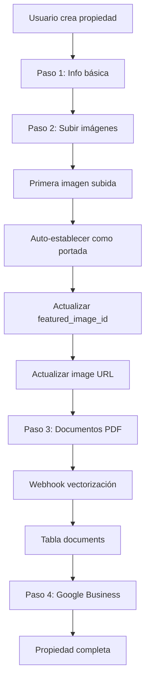

# Simplificación del Modal de Creación de Propiedades

## 📋 Resumen de Cambios

Se ha simplificado el flujo de creación de propiedades removiendo la complejidad de la imagen de portada en la información básica y automatizando este proceso.

## 🔄 Flujo Anterior vs Nuevo

### ❌ **Flujo Anterior (Complejo)**
```
Paso 1: Información Básica
├── Nombre *
├── Dirección *
├── Descripción
├── Estado
└── 📸 IMAGEN DE PORTADA (manual, complejo)

Paso 2: Imágenes Adicionales
├── Subir imágenes múltiples
└── Descripciones

Paso 3: Documentos
Paso 4: Google Business
```

### ✅ **Flujo Nuevo (Simplificado)**
```
Paso 1: Información Básica
├── Nombre *
├── Dirección *  
├── Descripción
├── Estado
└── 💡 Mensaje informativo sobre imagen automática

Paso 2: Imágenes  
├── Subir imágenes múltiples
├── 🎯 Primera imagen = PORTADA AUTOMÁTICA
└── Vista previa de portada establecida

Paso 3: Documentos → Webhook → Vectorización
Paso 4: Google Business
```

## 🛠️ Cambios Técnicos Implementados

### 1. **PropertyForm.tsx**

#### Removido:
```typescript
// ❌ Imagen principal manual
const [imagePreview, setImagePreview] = useState<string | null>(null);
const handleImageUpload = (e: React.ChangeEvent<HTMLInputElement>) => { ... }

// ❌ Sección de upload de imagen en paso 1
<div>
  <label>Imagen principal</label>
  <input type="file" onChange={handleImageUpload} />
</div>
```

#### Agregado:
```typescript
// ✅ Lógica automática de imagen de portada
useEffect(() => {
  if (!property && formData.additional_images && formData.additional_images.length > 0) {
    const firstImage = formData.additional_images[0];
    if (firstImage.file_url && !formData.image) {
      console.log("🖼️ Estableciendo automáticamente la primera imagen como portada");
      setFormData(prev => ({
        ...prev,
        image: firstImage.file_url
      }));
    }
  }
}, [formData.additional_images, property, formData.image]);

// ✅ Mensaje informativo en paso 1
<div className="bg-blue-50 border border-blue-200 rounded-md p-4">
  <h3>Imagen de portada automática</h3>
  <p>La primera imagen que subas en la siguiente pestaña se convertirá 
     automáticamente en la imagen de portada de la propiedad.</p>
</div>

// ✅ Preview de portada en paso 2
{formData.image && (
  <div className="bg-green-50 border border-green-200 rounded-md">
    <h3>Imagen de portada establecida</h3>
    
    <p>Esta será la imagen principal que se mostrará en las listas.</p>
  </div>
)}
```

### 2. **PropertyManagementPage.tsx**

#### Agregado:
```typescript
// ✅ Lógica automática de featured_image_id
if (uploadedImages.length > 0) {
  const firstImage = uploadedImages[0];
  console.log(`🎯 Estableciendo imagen de portada automáticamente`);
  
  // Actualizar la propiedad con la imagen de portada
  const { data: updatedProperty, error: updateError } = await supabase
    .from("properties")
    .update({
      featured_image_id: firstImage.id,
      image: firstImage.url
    })
    .eq("id", savedProperty.id)
    .select()
    .single();
}
```

### 3. **Script de Testing**

Creado `scripts/test-property-creation-flow.js` para verificar:
- ✅ Estructura de tablas (`properties`, `media_files`, `documents`)
- ✅ Relaciones entre `featured_image_id` y `media_files`
- ✅ Lógica de primera imagen como portada
- ✅ Flujo de documentos con vectorización

## 🔄 Flujo de Datos Completo

### Creación de Propiedad:


### Estructura de Base de Datos:
```sql
-- Tabla principal
properties (
  id, name, address, 
  featured_image_id → media_files.id,
  image (URL directo para compatibilidad)
)

-- Archivos (imágenes y documentos)  
media_files (
  id, property_id, file_type,
  file_url, title, category
)

-- Contenido vectorizado para RAG
documents (
  id, property_id, content,
  embedding vector(1536)
)

-- Enlaces compartibles
shareable_links (
  id, property_id, target_id → media_files.id
)
```

## 📱 Experiencia de Usuario

### Antes:
1. 😰 **Confuso**: Usuario debe elegir imagen de portada en paso 1
2. 🤔 **Indecisión**: ¿Qué imagen usar como portada antes de ver todas?
3. 📱 **Complejo**: Proceso de upload separado y manual

### Después:
1. 😊 **Simple**: Solo llenar información básica
2. 🎯 **Intuitivo**: Primera imagen subida = portada automática
3. ✅ **Visual**: Preview inmediato de la portada establecida
4. 🔄 **Automático**: Sin decisiones manuales complejas

## 🧪 Cómo Probar

1. **Ejecutar test script:**
```bash
node scripts/test-property-creation-flow.js
```

2. **Crear propiedad nueva:**
   - Paso 1: Llenar info básica (ver mensaje informativo)
   - Paso 2: Subir 2-3 imágenes (ver preview de portada)
   - Paso 3: Subir PDF (verificar webhook en logs)
   - Paso 4: Completar

3. **Verificar resultado:**
   - Propiedad tiene `featured_image_id` = primera imagen
   - Campo `image` apunta a URL de primera imagen
   - PDF aparece en tabla `documents` (vectorizado)

## 💡 Beneficios

### Para el Usuario:
- ✅ **Menos pasos** complejos
- ✅ **Experiencia más fluida**
- ✅ **Sin decisiones prematuras**
- ✅ **Feedback visual inmediato**

### Para el Sistema:
- ✅ **Datos más consistentes**
- ✅ **Menos errores de usuario**
- ✅ **Flujo automatizado**
- ✅ **Mejor UX general**

### Para el Desarrollo:
- ✅ **Código más simple**
- ✅ **Menos estados manuales**
- ✅ **Lógica predecible**
- ✅ **Fácil mantenimiento**

## 🔮 Próximas Mejoras

1. **Reordenar imágenes**: Permitir cambiar cuál es la portada después
2. **Preview mejorado**: Mostrar cómo se verá en listados
3. **Validaciones**: Asegurar que hay al menos una imagen
4. **Bulk upload**: Arrastrar y soltar múltiples archivos
5. **Crop automático**: Optimizar imágenes para portada

---

> **Nota**: Este cambio simplifica significativamente la experiencia del usuario mientras mantiene toda la funcionalidad del sistema de vectorización de documentos y gestión de archivos. 