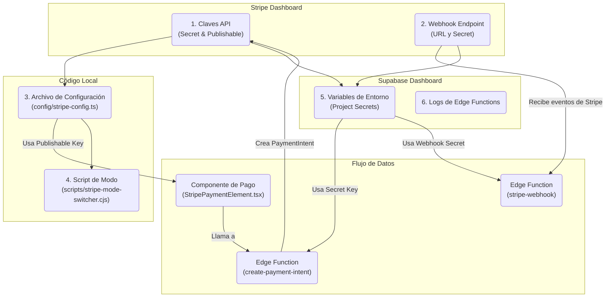

# Plan de Verificación de Integración de Stripe (08/07/2025)

Este documento resume los pasos necesarios para auditar y verificar la correcta configuración de la integración de Stripe en el proyecto. El objetivo es asegurar que tanto el flujo de pago como los webhooks funcionen correctamente.

## Esquema Visual del Flujo

El siguiente diagrama ilustra las conexiones clave entre el Dashboard de Stripe, el código local y los servicios de Supabase.

## Pasos Detallados para la Verificación

### Paso 1: Verificar las Claves en el Dashboard de Stripe

1.  **Iniciar sesión en el [Dashboard de Stripe](https://dashboard.stripe.com/).**
2.  Navegar a **Desarrolladores > Claves de API**.
3.  Confirmar la existencia y corrección de las claves para los modos de prueba y producción.
    *   **Clave publicable:** `pk_test_...` (prueba) y `pk_live_...` (real).
    *   **Clave secreta:** `sk_test_...` (prueba) y `sk_live_...` (real).

### Paso 2: Verificar el Endpoint del Webhook en Stripe

1.  En el Dashboard de Stripe, ir a **Desarrolladores > Webhooks**.
2.  Localizar el endpoint que apunta a la función de Supabase (`.../functions/v1/stripe-webhook`).
3.  **Comprobar los siguientes puntos**:
    *   **URL del endpoint**: Debe ser correcta.
    *   **Estado**: Debe estar **activado**.
    *   **Eventos a enviar**: Asegurarse de que esté suscrito como mínimo a:
        *   `customer.subscription.created`
        *   `customer.subscription.updated`
        *   `customer.subscription.deleted`
    *   **Secreto del webhook**: Revelar y copiar el secreto (`whsec_...`) para usarlo en Supabase.

### Paso 3: Auditar las Variables de Entorno en Supabase (Paso Crítico)

Esta es la causa más probable de fallos en las funciones Edge.

1.  **Ir al proyecto en [Supabase](https://app.supabase.com).**
2.  Navegar a **Configuración del Proyecto > Edge Functions**.
3.  **Verificar que las siguientes variables de entorno (secrets) estén configuradas correctamente**:
    *   `STRIPE_SECRET_KEY`: Debe corresponder a la clave secreta de Stripe (`sk_test_...` o `sk_live_...`).
    *   `STRIPE_WEBHOOK_SECRET`: Debe ser el secreto del webhook obtenido en el Paso 2.

### Paso 4: Revisar la Configuración Local

1.  Abrir el archivo `config/stripe-config.ts`.
2.  Confirmar que las claves publicables (`pk_test`, `pk_live`) y los IDs de los planes sean correctos.
3.  Usar el script de cambio de modo para asegurar que el entorno de prueba es el adecuado.
    *   Ejecutar `node scripts/stripe-mode-switcher.cjs` para ver el modo actual.
    *   Para pruebas, se recomienda usar el modo "demo producción": `node scripts/stripe-mode-switcher.cjs 2`. 